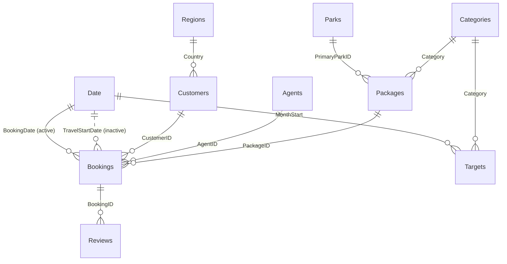

# Twiga Trails Safaris — Power BI Student Guide

**Dataset:** [`data/`](data/) · 13,927 raw booking rows for 2023–2025 · 6,500 customers · 18 safari packages · 6,759 reviews · Currency: USD

You are a data analyst for Twiga Trails Safaris, a fictional Nairobi safari operator. The CEO needs one trusted report instead of conflicting spreadsheets. You will turn synthetic source files into a clean model, answer business questions, publish the report, restrict it by sales region, and configure refresh.

Keep every source file unchanged. Perform all cleaning in Power Query so another analyst can repeat it.

---

## Scenario

Twiga Trails sells trips in Kenya, Tanzania, Uganda, and Rwanda through direct, online travel agency (OTA), tour-operator, and corporate channels. Your report must answer:

- How much revenue and gross profit do we make, and how quickly are they growing?
- Are we meeting finance's monthly revenue targets?
- When do customers book, and when do they travel?
- Which channels, packages, parks, and customer regions drive performance?
- Which channels have the highest cancellation rate?
- How satisfied are guests, based on ratings and Net Promoter Score (NPS)?

You are done when you have a `.pbix` file with a documented star schema, validated measures, five report pages, working interactions, row-level security (RLS), and a published report with refresh configured. You will also present three evidence-based recommendations.

## Tools and setup

- **Power BI Desktop runs on Windows only.** Install the current version before you begin.
- **Power BI Service requires a work or school Microsoft account.** A personal Gmail or Outlook.com address cannot complete the publish and sharing stage. Confirm your cohort's licence and workspace access.
- In Power BI Desktop, set the current file's import locale to **English (United States)** under regional settings. This makes values such as `0.05` parse as decimals. Power BI wording can change between releases; search Settings for the named feature if its location differs.
- Use a short local path such as `C:\Workshop\twiga-trails\`.

Get the files in either of these ways:

1. Clone the repository, then open [`powerbi-safari-workshop/`](./).

   ```text
   git clone https://github.com/LuxDevHQ/Data.git
   cd Data/powerbi-safari-workshop
   ```

2. Download [`TwigaTrails_PowerBI_Workshop_Kit.zip`](https://github.com/LuxDevHQ/Data/raw/main/powerbi-safari-workshop/TwigaTrails_PowerBI_Workshop_Kit.zip), then extract it.

Work from the extracted folder. Do not edit, rename, or overwrite anything in [`data/`](data/). Do not move the 2026 file until Stage 8.

## Data dictionary

The files are synthetic. The main booking extracts cover 1 January 2023 through 31 December 2025. The later extract covers January through June 2026. Data was extracted on 30 June 2026, so travel after that date is still `Confirmed`.

### `data/Bookings/Bookings_2023.csv`, `Bookings_2024.csv`, and `Bookings_2025.csv`

Grain: one booking. Raw rows: 3,867; 4,626; and 5,434. `BookingDate` ranges cover each calendar year. Across these files, `TravelStartDate` ranges from 11 January 2023 through 29 December 2026.

| Column | Power BI type | Meaning / observed values |
|---|---|---|
| `BookingID` | Text | Booking key |
| `BookingDate` | Date | Date booked; revenue recognition date |
| `TravelStartDate` | Date | First travel date |
| `CustomerID` | Text | Customer key |
| `PackageID` | Text | Package key; `PK01`–`PK18` (`PK18` is absent in 2023) |
| `AgentID` | Text | Agent key; may be empty in raw data |
| `Adults` | Whole number | Adults, 1–12 |
| `Children` | Whole number | Children, 0–3 |
| `UnitPriceUSD` | Decimal number | Adult package price in USD |
| `DiscountPct` | Decimal number | Decimal discount: 0, 0.05, 0.10, or 0.15; may be empty |
| `Status` | Text | Raw variants of completed, confirmed, and cancelled |
| `PaymentMethod` | Text | Bank Transfer, Card, M-Pesa, or PayPal |

### `data/_later/Bookings_2026_H1.csv`

Grain: one booking. Raw rows: 2,708. It has the same 12 columns as the other booking files. `BookingDate` is 1 January–30 June 2026 and `TravelStartDate` is 5 January–31 December 2026. Use it only in Stage 8.

### `data/Customers.xlsx` — `Customers` sheet

Grain: one customer. Rows after the header: 6,500. The worksheet contains non-tabular rows before its header.

| Column | Power BI type | Meaning / observed values |
|---|---|---|
| `CustomerID` | Text | Customer key |
| `FirstName` | Text | Synthetic given name |
| `LastName` | Text | Synthetic family name |
| `Country` | Text | Raw customer country text |
| `Segment` | Text | Corporate, Couple, Family, Group, or Solo |
| `AgeBand` | Text | 18–24, 25–34, 35–44, 45–54, 55–64, or 65+ |
| `JoinDate` | Date | Customer join date |

### `data/Packages.csv`

Grain: one package. Rows: 18. Launch dates range from 1 January 2018 through 1 July 2024.

| Column | Power BI type | Meaning / observed values |
|---|---|---|
| `PackageID` | Text | Package key, `PK01`–`PK18` |
| `PackageName` | Text | Package name |
| `Category` | Text | Budget, Mid-Range, or Luxury |
| `DurationDays` | Whole number | 3–12 days |
| `PrimaryParkID` | Text | Main park key, `P01`–`P10` |
| `BasePriceUSD` | Decimal number | Listed base price in USD |
| `CostPerPaxUSD` | Decimal number | Tour cost per traveller in USD |
| `LaunchDate` | Date | Package launch date |

### `data/Parks.csv`

Grain: one park or reserve. Rows: 10.

| Column | Power BI type | Meaning / observed values |
|---|---|---|
| `ParkID` | Text | Park key, `P01`–`P10` |
| `ParkName` | Text | Park or reserve name |
| `Country` | Text | Kenya, Rwanda, Tanzania, or Uganda |
| `Latitude` | Decimal number | Map latitude, −4.1667 to 0.62 |
| `Longitude` | Decimal number | Map longitude, 29.5333 to 38.75 |
| `Ecosystem` | Text | Ecosystem description |
| `ParkFeeUSDPerDay` | Decimal number | Daily park fee in USD |

### `data/Agents.csv`

Grain: one sales agent. Rows: 14.

| Column | Power BI type | Meaning / observed values |
|---|---|---|
| `AgentID` | Text | Agent key, `AG00`–`AG13` |
| `AgentName` | Text | Direct desk or partner name |
| `Channel` | Text | Corporate, Direct, OTA, or Tour Operator |
| `BaseCountry` | Text | Agent base country |
| `CommissionPct` | Decimal number | Decimal commission, 0–0.17 |

### `data/Regions.csv`

Grain: one customer country. Rows: 17.

| Column | Power BI type | Meaning / observed values |
|---|---|---|
| `Country` | Text | Canonical country key |
| `Continent` | Text | Africa, Asia, Europe, North America, Oceania, or South America |
| `SalesRegion` | Text | Americas, Asia-Pacific, Europe, or Middle East & Africa |
| `RegionalManager` | Text | Synthetic regional manager |
| `ManagerEmail` | Text | Synthetic sign-in value used for dynamic RLS |

### `data/Reviews.csv`

Grain: one review. Rows: 6,759. `ReviewDate` ranges from 18 January 2023 through 30 June 2026.

| Column | Power BI type | Meaning / observed values |
|---|---|---|
| `ReviewID` | Text | Review key |
| `BookingID` | Text | Reviewed booking key |
| `ReviewDate` | Date | Date submitted; not the analysis date |
| `Rating` | Whole number | Star rating, 1–5 |
| `NPSScore` | Whole number | Recommendation score, 1–10 in these files |
| `ReviewText` | Text | Synthetic written feedback |

### `data/Targets.csv`

Grain: one month × category. Rows: 144. `MonthStart` ranges from 1 January 2023 through 1 December 2026.

| Column | Power BI type | Meaning / observed values |
|---|---|---|
| `MonthStart` | Date | First day of target month |
| `Category` | Text | Budget, Mid-Range, or Luxury |
| `TargetRevenueUSD` | Decimal number | Monthly category revenue target in USD |

## Business rules

Use these definitions exactly:

- Net amount = `(Adults + 0.5 × Children) × UnitPriceUSD × (1 − DiscountPct)`
- Net revenue = sum of net amount where Status ≠ Cancelled, recognised on **BookingDate**
- Travellers (Pax) = Adults + Children on non-cancelled bookings
- Tour cost = Pax × `Packages[CostPerPaxUSD]`
- Commission = net amount × `Agents[CommissionPct]`
- Gross profit = net revenue − tour cost − commission
- Cancellation rate = cancelled bookings ÷ all bookings (after de-duplication)
- NPS = % of reviews with NPSScore 9–10 − % with 0–6, on a −100 to 100 scale
- Reviews are analysed through their booking, not their review date

## Stage 1 — Get data

**Goal:** Create reusable connections without cleaning the source files.

1. Open Power Query with **Transform data**. Create a Text parameter named `DataFolder`. Set it to the full path of [`data/`](data/) with a trailing backslash, such as `C:\Workshop\twiga-trails\data\`.
2. Use the **Folder** connector for [`data/Bookings/`](data/Bookings/). Choose **Combine & Transform Data** and rename the combined query `Bookings`. Do not include [`data/_later/`](data/_later/) yet.
3. Connect to `Customers.xlsx` with the Excel workbook connector. Select the `Customers` sheet.
4. Connect separately to `Packages.csv`, `Parks.csv`, `Agents.csv`, `Regions.csv`, `Reviews.csv`, and `Targets.csv` with the Text/CSV connector.
5. In each non-booking query's `Source` step, replace the fixed folder with `DataFolder`, for example `File.Contents(DataFolder & "Packages.csv")`.
6. Select **Transform Data**, not **Load**, until profiling is complete.

*Why:* A parameter stores a changeable value once. A folder query automatically incorporates later files with the same schema.

**Checkpoint**

| Check | Expected |
|---|---:|
| Booking source files combined | 3 |
| Raw booking rows | 13,927 |
| Other source queries | 7 |
| 2026 booking rows loaded now | 0 |

## Stage 2 — Profile and clean in Power Query

**Goal:** Discover quality problems, repair them reproducibly, and add calculation inputs.

1. In Power Query, enable **Column quality**, **Column distribution**, and **Column profile** from the View tab.
2. Change profiling from the top 1,000 rows to the **entire data set** in the status bar.
3. Inspect nulls, errors, distinct counts, value frequency, minimums, maximums, keys, and unexpected spellings. Compare annual file counts with the source table above.
4. Record each issue before changing it. Use named Applied Steps and verify the row count after every step.
5. Try to resolve the problems yourself. Open the solutions only after you can explain what is wrong and why your proposed fix matches a business rule.

<details>
<summary>Solution: clean Bookings and add helper columns</summary>

Replace the combined `Bookings` query in Advanced Editor with this complete query. It filters hidden or stray non-CSV files, promotes each file's headers, sets types with the US locale, repairs the discovered values, and adds `Pax`, `NetAmountUSD`, and `LeadTimeDays`.

```m
let
    Source = Folder.Files(DataFolder & "Bookings"),
    CsvOnly = Table.SelectRows(Source, each Text.Lower([Extension]) = ".csv" and [Attributes]?[Hidden]? <> true),
    Parsed = Table.AddColumn(CsvOnly, "Data", each Table.PromoteHeaders(
        Csv.Document([Content], [Delimiter = ",", Encoding = 65001, QuoteStyle = QuoteStyle.Csv]),
        [PromoteAllScalars = true]
    )),
    Kept = Table.SelectColumns(Parsed, {"Name", "Data"}),
    Expanded = Table.ExpandTableColumn(Kept, "Data", {
        "BookingID", "BookingDate", "TravelStartDate", "CustomerID", "PackageID", "AgentID",
        "Adults", "Children", "UnitPriceUSD", "DiscountPct", "Status", "PaymentMethod"
    }),
    Renamed = Table.RenameColumns(Expanded, {{"Name", "SourceFile"}}),
    Typed = Table.TransformColumnTypes(Renamed, {
        {"SourceFile", type text}, {"BookingID", type text}, {"BookingDate", type date},
        {"TravelStartDate", type date}, {"CustomerID", type text}, {"PackageID", type text},
        {"AgentID", type text}, {"Adults", Int64.Type}, {"Children", Int64.Type},
        {"UnitPriceUSD", type number}, {"DiscountPct", type number}, {"Status", type text},
        {"PaymentMethod", type text}
    }, "en-US"),
    Deduped = Table.Distinct(Typed, {"BookingID"}),
    StatusTidy = Table.TransformColumns(Deduped, {{"Status", each Text.Proper(Text.Trim(_)), type text}}),
    StatusFixed = Table.ReplaceValue(StatusTidy, "Canceled", "Cancelled", Replacer.ReplaceValue, {"Status"}),
    DiscountFixed = Table.ReplaceValue(StatusFixed, null, 0, Replacer.ReplaceValue, {"DiscountPct"}),
    AgentFixed = Table.TransformColumns(DiscountFixed, {
        {"AgentID", each if _ = null or _ = "" then "AG00" else _, type text}
    }),
    AddedPax = Table.AddColumn(AgentFixed, "Pax", each [Adults] + [Children], Int64.Type),
    AddedNet = Table.AddColumn(AddedPax, "NetAmountUSD", each
        ([Adults] + 0.5 * [Children]) * [UnitPriceUSD] * (1 - [DiscountPct]), type number),
    AddedLead = Table.AddColumn(AddedNet, "LeadTimeDays", each
        Duration.Days([TravelStartDate] - [BookingDate]), Int64.Type)
in
    AddedLead
```

Remove duplicates by `BookingID`, not by every column. This protects the intended booking grain.

</details>

<details>
<summary>Solution: clean Customers and standardise country keys</summary>

Replace `Customers` in Advanced Editor with this complete query. The replacements map source variants to keys that exist in `Regions`.

```m
let
    Source = Excel.Workbook(File.Contents(DataFolder & "Customers.xlsx"), null, true),
    Sheet = Source{[Item = "Customers", Kind = "Sheet"]}[Data],
    NoTitle = Table.Skip(Sheet, 2),
    Headers = Table.PromoteHeaders(NoTitle, [PromoteAllScalars = true]),
    Typed = Table.TransformColumnTypes(Headers, {
        {"CustomerID", type text}, {"FirstName", type text}, {"LastName", type text},
        {"Country", type text}, {"Segment", type text}, {"AgeBand", type text},
        {"JoinDate", type date}
    }, "en-US"),
    Trimmed = Table.TransformColumns(Typed, {{"Country", Text.Trim, type text}}),
    Fixes = {
        {"USA", "United States"}, {"U.S.A.", "United States"}, {"usa", "United States"},
        {"United States of America", "United States"},
        {"UK", "United Kingdom"}, {"U.K.", "United Kingdom"},
        {"Great Britain", "United Kingdom"}, {"UAE", "United Arab Emirates"},
        {"The Netherlands", "Netherlands"}, {"Holland", "Netherlands"},
        {"germany", "Germany"}, {"Deutschland", "Germany"}
    },
    Cleaned = List.Accumulate(Fixes, Trimmed, (TableState, Pair) =>
        Table.ReplaceValue(TableState, Pair{0}, Pair{1}, Replacer.ReplaceValue, {"Country"})),
    AddedFullName = Table.AddColumn(Cleaned, "FullName", each [FirstName] & " " & [LastName], type text)
in
    AddedFullName
```

</details>

<details>
<summary>Solution: create the Categories dimension</summary>

Create a **Reference** from `Packages`, rename it `Categories`, and use this complete query. A reference keeps the transformation connected to its source.

```m
let
    Source = Packages,
    KeptCategory = Table.SelectColumns(Source, {"Category"}),
    DistinctCategories = Table.Distinct(KeptCategory),
    AddedCategoryOrder = Table.AddColumn(DistinctCategories, "CategoryOrder", each
        if [Category] = "Budget" then 1
        else if [Category] = "Mid-Range" then 2
        else 3, Int64.Type)
in
    AddedCategoryOrder
```

</details>

Disable load for automatically generated folder helper queries. Confirm types for all lookup files against the data dictionary. Then select **Close & Apply**.

*Why:* Profiling reveals errors before they enter visuals. Stable keys and one-row-per-entity tables prevent missing matches and double counting.

**Checkpoint**

| Check | Expected |
|---|---:|
| `Bookings` rows | 13,890 |
| `Customers` rows | 6,500 |
| Distinct customer countries | 17 |
| Distinct booking statuses | 3 |
| Blank `AgentID` values | 0 |
| `Categories` rows | 3 |

## Stage 3 — Model the star

**Goal:** Build a star schema: a central event table surrounded by descriptive dimension tables.



1. In Model view, add this calculated Date table. A date table supplies every date, even dates with no bookings, so time intelligence works.

   ```dax
   Date =
   ADDCOLUMNS (
       CALENDAR ( DATE ( 2023, 1, 1 ), DATE ( 2026, 12, 31 ) ),
       "Year", YEAR ( [Date] ),
       "Month No", MONTH ( [Date] ),
       "Month", FORMAT ( [Date], "mmm" ),
       "Quarter", "Q" & QUARTER ( [Date] ),
       "Year-Month", FORMAT ( [Date], "yyyy-mm" ),
       "Season",
           SWITCH (
               TRUE (),
               MONTH ( [Date] ) IN { 7, 8, 9, 10 }, "Migration peak",
               MONTH ( [Date] ) IN { 12, 1 }, "Festive peak",
               MONTH ( [Date] ) IN { 4, 5 }, "Long rains",
               "Shoulder"
           )
   )
   ```

2. Mark `Date` as the model's date table using `Date[Date]`. Sort `Date[Month]` by `Date[Month No]`.
3. Create every relationship below. `1` means the key is unique. `*` means many rows may use it. Use single-direction filtering from `1` to `*`.

| From (`*`) | To (`1`) | Active | Direction |
|---|---|---|---|
| `Bookings[BookingDate]` | `Date[Date]` | Yes | Single |
| `Bookings[TravelStartDate]` | `Date[Date]` | No | Single |
| `Bookings[CustomerID]` | `Customers[CustomerID]` | Yes | Single |
| `Bookings[PackageID]` | `Packages[PackageID]` | Yes | Single |
| `Bookings[AgentID]` | `Agents[AgentID]` | Yes | Single |
| `Customers[Country]` | `Regions[Country]` | Yes | Single |
| `Packages[PrimaryParkID]` | `Parks[ParkID]` | Yes | Single |
| `Packages[Category]` | `Categories[Category]` | Yes | Single |
| `Reviews[BookingID]` | `Bookings[BookingID]` | Yes | Single |
| `Targets[MonthStart]` | `Date[Date]` | Yes | Single |
| `Targets[Category]` | `Categories[Category]` | Yes | Single |

4. Do not relate `Reviews[ReviewDate]` to `Date`. Reviews must inherit the booking's date through `Bookings`; a direct link creates two filter paths and makes the model ambiguous.
5. Set the latitude and longitude data categories. Format percentage and currency fields. Hide technical keys from report view.
6. Use **Enter data** to create a one-column placeholder table called `_Measures`. Move measures to this table and hide its placeholder column.

*Why:* Single-direction relationships make filter behaviour predictable. The inactive travel relationship lets one Date table answer two date questions without ambiguity.

**Checkpoint**

| Check | Expected |
|---|---:|
| Active relationships | 10 |
| Inactive relationships | 1 |
| Date range | 1 Jan 2023–31 Dec 2026 |
| Unmatched customer region shown as `(Blank)` | 0 |

## Stage 4 — Write DAX measures

**Goal:** Define reusable calculations in build order. DAX is Power BI's formula language.

`CALCULATE` evaluates an expression under added or changed filters. `SUMX` visits rows and evaluates an expression for each; `RELATED` fetches a value from the related one-side table. `USERELATIONSHIP` activates a named inactive relationship only for one calculation.

Create each measure separately in `_Measures`.

### Core measures

```dax
Bookings = COUNTROWS ( Bookings )
```
Counts booking rows after the current filters.

```dax
Cancelled Bookings = CALCULATE ( [Bookings], Bookings[Status] = "Cancelled" )
```
Counts only cancelled bookings.

```dax
Cancellation Rate = DIVIDE ( [Cancelled Bookings], [Bookings] )
```
Divides cancelled bookings by all bookings safely.

```dax
Travellers = CALCULATE ( SUM ( Bookings[Pax] ), Bookings[Status] <> "Cancelled" )
```
Adds adults and children for non-cancelled bookings.

```dax
Net Revenue = CALCULATE ( SUM ( Bookings[NetAmountUSD] ), Bookings[Status] <> "Cancelled" )
```
Adds net booking amounts while excluding cancellations.

```dax
Tour Cost =
CALCULATE (
    SUMX ( Bookings, Bookings[Pax] * RELATED ( Packages[CostPerPaxUSD] ) ),
    Bookings[Status] <> "Cancelled"
)
```
Multiplies each booking's travellers by its related package cost before adding the rows.

```dax
Commission =
CALCULATE (
    SUMX ( Bookings, Bookings[NetAmountUSD] * RELATED ( Agents[CommissionPct] ) ),
    Bookings[Status] <> "Cancelled"
)
```
Calculates commission booking by booking and excludes cancellations.

```dax
Gross Profit = [Net Revenue] - [Tour Cost] - [Commission]
```
Subtracts tour costs and commission from revenue.

```dax
Gross Margin % = DIVIDE ( [Gross Profit], [Net Revenue] )
```
Expresses gross profit as a share of revenue.

```dax
Avg Booking Value = DIVIDE ( [Net Revenue], [Bookings] - [Cancelled Bookings] )
```
Shows average revenue per non-cancelled booking.

```dax
Avg Lead Time (days) = AVERAGE ( Bookings[LeadTimeDays] )
```
Shows the mean days between booking and travel.

### Time intelligence

```dax
Revenue LY = CALCULATE ( [Net Revenue], SAMEPERIODLASTYEAR ( 'Date'[Date] ) )
```
Returns revenue for the equivalent period one year earlier.

```dax
Revenue YoY % = DIVIDE ( [Net Revenue] - [Revenue LY], [Revenue LY] )
```
Shows year-over-year revenue growth.

```dax
Revenue YTD = TOTALYTD ( [Net Revenue], 'Date'[Date] )
```
Accumulates revenue from the start of the year.

```dax
Revenue Rolling 3M =
CALCULATE (
    [Net Revenue],
    DATESINPERIOD ( 'Date'[Date], MAX ( 'Date'[Date] ), -3, MONTH )
)
```
Returns revenue over the three-month window ending at the current date.

```dax
Revenue by Travel Date =
CALCULATE (
    [Net Revenue],
    USERELATIONSHIP ( Bookings[TravelStartDate], 'Date'[Date] )
)
```
Temporarily uses travel date instead of booking date.

### Targets

```dax
Revenue Target = SUM ( Targets[TargetRevenueUSD] )
```
Adds targets for the visible months and categories.

```dax
Target Variance % = DIVIDE ( [Net Revenue] - [Revenue Target], [Revenue Target] )
```
Shows performance above or below target.

### Guest experience and ranking

```dax
Review Count = COUNTROWS ( Reviews )
```
Counts reviews connected to visible bookings.

```dax
Avg Rating = AVERAGE ( Reviews[Rating] )
```
Averages the 1–5 guest ratings.

```dax
NPS =
VAR Responses = COUNTROWS ( Reviews )
VAR Promoters = CALCULATE ( COUNTROWS ( Reviews ), Reviews[NPSScore] >= 9 )
VAR Detractors = CALCULATE ( COUNTROWS ( Reviews ), Reviews[NPSScore] <= 6 )
RETURN
    DIVIDE ( Promoters - Detractors, Responses ) * 100
```
Subtracts the detractor share from the promoter share on the −100 to 100 scale.

```dax
Package Rank = RANKX ( ALL ( Packages[PackageName] ), [Net Revenue] )
```
Ranks packages by revenue while keeping other report filters.

Format money as USD currency, rates and margins as percentages, counts as whole numbers, and NPS and rating to one decimal place.

*Why:* Central measures give every visual the same definition. Measures respond to slicers without storing repeated results in the model.

**Checkpoint — filter `Date[Year]` to 2025**

| Measure | Expected |
|---|---:|
| Bookings | 5,434 |
| Cancellation rate | 9.81% |
| Travellers | 17,133 |
| Net revenue | $53,358,318.50 |
| Gross profit | $19,794,880.68 |
| Gross margin | 37.1% |
| Average booking value | $10,887.23 |
| Revenue last year | $39,694,230.62 |
| Revenue YoY | +34.4% |
| Revenue target | $53,663,000.00 |
| Target variance | −0.6% |
| Average rating | 4.12 |
| NPS | 35.4 |

Targets occur on the first day of each month. Use them only at month level or higher.

## Stage 5 — Build the report

**Goal:** Make five focused pages in which every visual answers one business question.

1. Save the following as `twiga-theme.json`, then import it with the report theme feature.

   ```json
   {
     "name": "Twiga Trails",
     "dataColors": ["#2D5B44", "#C08A2E", "#7A9E7E", "#8C4A2F", "#4F6D8A", "#B9A06A"],
     "background": "#FFFFFF",
     "foreground": "#18211C",
     "tableAccent": "#2D5B44"
   }
   ```

2. Build the pages below.

| Page | Business question | Required visuals |
|---|---|---|
| Executive overview | Are we growing and on target? | KPI cards for revenue, profit, margin, YoY, cancellations, and NPS; revenue versus target by Year-Month; revenue by category; Year, region, and channel slicers |
| Seasonality & demand | When do guests book and travel? | Booking-date and travel-date revenue lines by Month; Season × Category matrix with travellers and travel-date revenue; average lead time by category |
| Channels & customers | Who sells for us, and who cancels? | Cancellation rate by channel; agent table with revenue, commission, and margin; revenue bars by sales region and segment |
| Packages & parks | What are we selling? | Park map sized by travellers; package table with rank, revenue, margin, and rating; monthly `PK18` revenue since July 2024 |
| Guest experience | Where do we disappoint guests? | Rating, NPS, and review count cards; rating by travel Month; review-text table filtered to rating ≤ 2 |
| Package snapshot | What should a package tooltip show? | Tooltip-sized page with revenue and rating cards and travellers by Season |

3. Use titles that state the question or finding. Label USD and percentages. Sort categories by `CategoryOrder` and months by `Month No`.
4. Keep a consistent grid, font, colour meaning, and slicer position. Avoid 3D visuals and crowded pie or donut charts. Add alt text and sufficient contrast.

*Why:* A page with one question helps a reader understand the conclusion quickly.

**Checkpoint**

| 2025 sales region | Net revenue |
|---|---:|
| Europe | $20,322,307.62 |
| Americas | $16,864,260.88 |
| Asia-Pacific | $8,683,855.00 |
| Middle East & Africa | $7,487,895.00 |

## Stage 6 — Add interactivity

**Goal:** Help a reader explore without losing context.

1. Use **Sync slicers** to apply Year and SalesRegion slicers to pages 1–4.
2. Duplicate Packages & parks as a hidden `Package detail` page. Put `Packages[PackageName]` in its drill-through field well and add a back button. Drill-through carries the selected package to a detail page.
3. Configure `Package snapshot` as a report tooltip and assign it to the package table. A report tooltip is a small report page shown on hover.
4. Place a chart and table in the same area on page 3. Use the Selection pane and two bookmarks named `Chart view` and `Table view`, then connect buttons to them. A bookmark saves a report view and object visibility.
5. Create a field parameter containing `[Net Revenue]`, `[Gross Profit]`, and `[Travellers]`. Use it on the overview trend and expose it as a slicer. A field parameter lets the reader switch the metric.

*Why:* These features add controlled exploration while keeping navigation clear.

**Checkpoint**

| Test | Expected |
|---|---|
| Change Year on page 1 | Pages 1–4 retain the selection |
| Right-click a package | Package detail opens with one package |
| Hover a package | Package snapshot appears |
| Select each bookmark | Only the intended chart or table shows |
| Change field parameter | Trend switches metric |

## Stage 7 — Apply row-level security

**Goal:** Restrict each manager to bookings from customers in that manager's sales region.

1. Create a static role named `Europe` and filter `Regions` with:

   ```dax
   [SalesRegion] = "Europe"
   ```

2. Use **View as** to test the `Europe` role. Confirm that the filter flows `Regions` → `Customers` → `Bookings` → `Reviews`.
3. Create a dynamic role named `Regional Manager`. Dynamic RLS uses the signed-in viewer instead of one role per region.

   ```dax
   [ManagerEmail] = USERPRINCIPALNAME ()
   ```

4. Test the role with **View as** and **Other user**. Use a `ManagerEmail` value configured by your facilitator. `USERPRINCIPALNAME()` returns the current viewer's sign-in name.

*Why:* Testing both a fixed rule and an identity-based rule makes the security path visible before publishing.

**Checkpoint — `Date[Year]` = 2025**

| Role region | Visible net revenue |
|---|---:|
| Europe | $20,322,307.62 |
| Americas | $16,864,260.88 |
| Asia-Pacific | $8,683,855.00 |
| Middle East & Africa | $7,487,895.00 |

Discuss the target chart before release. Targets have category and month grain, not region grain. Region RLS therefore filters revenue but not targets. Decide whether managers should not see this comparison or finance should supply regional targets.

## Stage 8 — Publish and refresh

**Goal:** Publish a secured report and prove that its folder source accepts a new file.

1. Save the report as `TwigaTrails_<YourName>.pbix`. Publish it to the cohort workspace in Power BI Service.
2. Open the published **semantic model's** security settings. Add test work or school accounts to the `Regional Manager` role. Roles restrict viewers; workspace Admins, Members, and Contributors have edit access and are not restricted in the same way, so validate with a Viewer.
3. Choose a refresh architecture:
   - **Local files:** install and configure an on-premises data gateway. The Service cannot reach your laptop path by itself.
   - **SharePoint or OneDrive for work:** move a copy of the source folder there, use the SharePoint Folder connector, and update the parameter/source. This cloud route does not need a gateway for those files.
4. In the semantic model settings, configure credentials and scheduled refresh. Nairobi uses East Africa Time, UTC+3, all year. Choose the Service time-zone setting that corresponds to Nairobi/East Africa, or convert the desired local time carefully. For example, 06:00 EAT is 03:00 UTC.
5. Copy [`data/_later/Bookings_2026_H1.csv`](data/_later/Bookings_2026_H1.csv) into the connected `Bookings` folder. Keep the original later file unchanged. Run **Refresh now** and check refresh history.
6. Pin the Net Revenue card and revenue trend to a new dashboard. If your Power BI capacity and visual support alerts, create an alert on a pinned Cancellation Rate card above 12%.

*Why:* Publishing shares the report; security controls rows; refresh keeps its semantic model current. The new file proves the folder pattern is reusable.

**Checkpoint**

| Check | Expected |
|---|---:|
| Bookings after refresh | 16,598 |
| H1 2026 net revenue | $31,277,216.25 |

## Stage 9 — Investigate and present insights

**Goal:** Turn validated visuals into decisions rather than simply describing charts.

1. Investigate at least three prompts:
   - Compare OTA cancellation risk with OTA commission cost.
   - Compare booking seasonality with travel seasonality and explain cash-flow or marketing implications.
   - Investigate the August rating dip by package and park.
   - Assess the July 2024 launch of `PK18`, Samburu & Laikipia Private Conservancy.
   - Compare Budget package popularity with gross-profit contribution.
   - Compare H1 2026 performance with the 2026 target outlook.
2. Check alternative explanations and filters. Do not claim causation from a pattern alone.
3. Write `insights.md` using this template, once for each insight:

   ```text
   ## Insight 1: <decision-focused title>

   Question:
   Evidence (measure, period, comparison, visual):
   Interpretation:
   Limitation or alternative explanation:
   Recommended action:
   How we will measure the result:
   ```

4. Present three findings in five minutes. For each, show evidence, explain why it matters, and recommend one concrete action.

*Why:* A useful analysis connects evidence to a decision and states its limits.

**Checkpoint**

| Check | Expected |
|---|---|
| Findings | 3 |
| Each finding includes | Evidence, “so what,” action, limitation |
| Presentation length | 5 minutes |

## Deliverables and submission

Keep generated work outside `data/`:

```text
twiga-trails-submission/
├── TwigaTrails_<YourName>.pbix
├── insights.md
├── twiga-theme.json
└── screenshots/
    ├── 01-power-query-checkpoint.png
    ├── 02-model-view.png
    ├── 03-measure-checkpoint.png
    ├── 04-report-pages.png
    ├── 05-view-as-rls.png
    ├── 06-service-security.png
    └── 07-refresh-history.png
```

Submit the folder through the channel named by Caleb Kilemba for your LuxDevHQ Data Analytics cohort. Share the Power BI report link there only after checking permissions with a Viewer test account. Do not post private tenant links, learner emails, or workspace screenshots publicly.

## Assessment rubric

| Area | Points | Excellent work |
|---|---:|---|
| Data preparation | 20 | All six discovered issues are fixed; steps are named; source is parameterised; checkpoint counts match |
| Data model | 20 | Clean star schema; correct cardinality and direction; marked Date table; keys hidden; no ambiguity |
| DAX | 20 | All measures validate; variables and `DIVIDE` are used appropriately; formats are correct |
| Report design | 15 | Each page answers one question; theme is consistent; visuals are readable and free of chart junk |
| Interactivity and security | 10 | Drill-through, tooltip, and bookmarks work; dynamic RLS passes View as testing |
| Service | 5 | Report is published; refresh is configured; 2026 file refreshes; alert is set where supported |
| Insight presentation | 10 | Three findings each contain evidence, business meaning, and a concrete recommendation |
| **Total** | **100** | |

## Troubleshooting

| Symptom | Likely cause | Fix |
|---|---|---|
| Decimal conversion or `DataFormat.Error` | Import locale expects comma decimals | Set import locale to English (United States), or change type using that locale |
| More than 13,890 cleaned booking rows | Duplicate key was not removed or another file entered the folder | Profile `BookingID`, remove duplicates by that key, and inspect `SourceFile` |
| Folder combine has unexpected rows or errors | Hidden lock, temporary, or system files were included | Keep only `.csv` files and exclude `[Attributes]?[Hidden]? = true` as in the M query |
| `(Blank)` appears in SalesRegion | A customer country does not match `Regions[Country]` | List unmatched customer countries, trim and standardise them, then confirm 17 matches |
| Time-intelligence measures are blank or wrong | Date table is not marked, date type is wrong, or active relationship is missing | Mark `Date` using `Date[Date]`; verify date types and `BookingDate` relationship |
| Months sort alphabetically | Month name is text | Sort `Date[Month]` by `Date[Month No]` |
| Map is blank | Coordinates are not categorized, map visuals are disabled, or tenant policy blocks them | Set Latitude/Longitude categories; enable the permitted map visual or ask the tenant admin |
| Cannot sign in or publish | Personal account, missing licence, or no workspace access | Use the cohort work/school account and ask the facilitator to confirm licence and role |
| Scheduled refresh fails | Service cannot reach a local path, credentials expired, gateway offline, or parameter points elsewhere | Check refresh history; repair credentials; bring gateway online or use SharePoint Folder; verify `DataFolder` |

## Progress checklist

- [ ] Setup: install current Power BI Desktop on Windows and confirm a work/school account.
- [ ] Stage 1: create `DataFolder` and connect all eight initial sources.
- [ ] Stage 2: profile the entire data set, document issues, apply reproducible fixes, and pass counts.
- [ ] Stage 3: create the Date table, relationships, formats, and `_Measures` table.
- [ ] Stage 4: build and format measures in order; pass the 2025 checkpoint.
- [ ] Stage 5: build five question-led pages and the tooltip page.
- [ ] Stage 6: test synced slicers, drill-through, tooltip, bookmarks, and field parameter.
- [ ] Stage 7: test static and dynamic RLS with View as.
- [ ] Stage 8: publish, assign RLS, configure refresh, add the 2026 file, and pass the refresh checkpoint.
- [ ] Stage 9: write three insights and present them in five minutes.
- [ ] Submission: save the required files, capture evidence, and test the shared report as a Viewer.

## Glossary

| Term | Meaning |
|---|---|
| Cardinality | Whether a relationship connects one or many matching rows on each side |
| DAX | Data Analysis Expressions, the formula language for Power BI models |
| Dimension | A descriptive table used to group or filter facts, such as Customers or Packages |
| Fact table | A table of measurable events; `Bookings` is the main fact here |
| Field parameter | A model object that lets a reader switch fields or measures in a visual |
| Grain | What one row represents |
| Measure | A DAX calculation evaluated in the current filter context |
| NPS | Net Promoter Score: promoter percentage minus detractor percentage |
| OTA | Online travel agency |
| Power Query | Power BI's data connection and transformation layer; it uses M |
| RLS | Row-level security, rules that restrict which rows a viewer can see |
| Semantic model | The published tables, relationships, calculations, and security behind a report |
| Star schema | A model with a central fact table connected to descriptive dimensions |
| Tooltip page | A small report page displayed when a reader hovers over a data point |
| Workspace | A controlled Power BI Service area for reports and semantic models |
